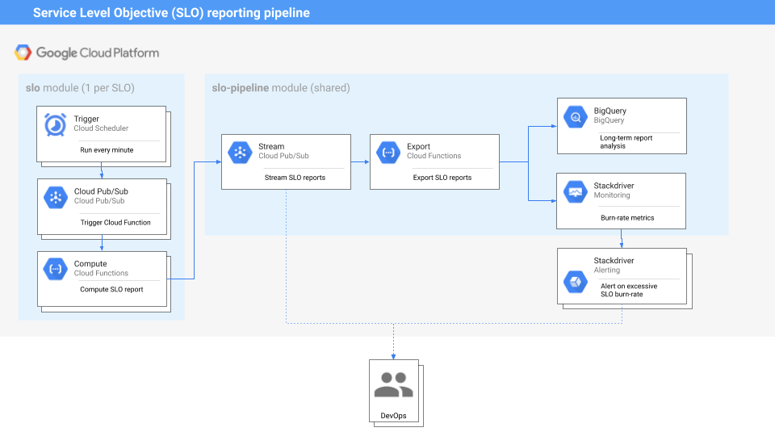

# terraform-google-slo

## Native SLOs (Service Monitoring API)
The [`slo-native`](./modules/slo-native) submodule deploys SLOs to Google Cloud Service Monitoring API. It uses the native Terraform resource [`google_monitoring_slo`](https://www.terraform.io/docs/providers/google/r/monitoring_slo.html) to achieve this.

**Use this module if:**
- Your SLOs will use metrics from Cloud Monitoring backend **only**, not other backends.

- You want to use the Service Monitoring UI to monitor your SLOs.

### Usage
Deploy your SLO directly to the Service Monitoring API:

#### HCL format
```hcl
module "slo_basic" {
  source = "terraform-google-modules/slo/google//modules/slo-native"
  config = {
    project_id        = var.app_engine_project_id
    service           = data.google_monitoring_app_engine_service.default.service_id
    slo_id            = "gae-slo"
    display_name      = "90% of App Engine default service HTTP response latencies < 500ms over a day"
    goal              = 0.9
    calendar_period   = "DAY"
    type              = "basic_sli"
    method            = "latency"
    latency_threshold = "0.5s"
  }
}
```
See [`examples/native/simple_example`](./examples/native/simple_example) for another example.

#### YAML format
You can also write an SLO in a YAML definition file and load it into the module:
```
locals {
  config = yamldecode(file("configs/my_slo_config.yaml"))
}

module "slo_basic" {
  source = "terraform-google-modules/slo/google//modules/slo-native"
  config = local.config
}
```
A standard SRE practice is to write SLO definitions as YAML files, and follow DRY principles. See [`examples/slo-generator/yaml_example`](./examples/native/yaml_example) for an example of how to write re-usable YAML templates loaded into Terraform.

## SLO generator (any monitoring backend)
The [`slo-pipeline`](./modules/slo-pipeline) and [`slo`] modules deploy the [`slo-generator`](https://github.com/GoogleCloudPlatform/professional-services/tree/master/tools/slo-generator)
in Cloud Functions in order to compute and export SLOs on a schedule.

**Use this setup if:**
- You are using other metrics backends than Cloud Monitoring that you want to create SLOs out of (e.g: Elastic, Datadog, Prometheus, ...).

- You want to have custom reporting and exporting for your SLO data, along with historical data (e.g: BigQuery, DataStudio, custom metrics).

- You want to have a common configuration format for all SLOs (see [documentation](https://github.com/google/slo-generator/README.md#configuration)).

### Architecture



This architecture requires two submodules:

* `slo`: This submodule deploys the infrastructure needed to compute SLO reports
for **one** SLO. Users should use **one invocation of this submodule by SLO defined**.
Once the SLO report is computed, the result is fed to the shared Pub/Sub topic
created by the `slo-pipeline` module.

* `slo-pipeline`: This submodule handles **exporting** SLO reports to different
destinations (Cloud Pub/Sub, BigQuery, Cloud Monitoring). The infrastructure is
shared by all SLOs and a Pub/Sub topic created as input stream for SLO reports.

### Compatibility
This module is meant for use with Terraform 0.13+ and tested using Terraform 1.0+. If you find incompatibilities using Terraform >=0.13, please open an issue.
 If you haven't
[upgraded](https://www.terraform.io/upgrade-guides/0-13.html) and need a Terraform
0.12.x-compatible version of this module, the last released version
intended for Terraform 0.12.x is [v1.0.2](https://registry.terraform.io/modules/terraform-google-modules/-slo/google/v1.0.2).

### Usage

First, deploy the SLO export pipeline (shared module):

```hcl
module "slo-pipeline" {
  source                      = "terraform-google-modules/slo/google//modules/slo-pipeline"
  function_name               = "slo-pipeline"
  region                      = "us-east"
  project_id                  = "test-project"
  exporters = [
    {
      class      = "Stackdriver"
      project_id = var.stackdriver_host_project_id
    },
    {
      class                      = "Bigquery"
      project_id                 = "test-project"
      dataset_id                 = "slo"
      table_id                   = "reports"
      location                   = "EU"
      delete_contents_on_destroy = true
    }
  ]
}
```

Now, deploy an SLO definition:

### HCL format
```hcl
module "slo" {
  source     = "terraform-google-modules/slo/google//modules/slo"
  schedule   = var.schedule
  region     = var.region
  project_id = var.project_id
  labels     = var.labels
  config = {
    slo_name        = "pubsub-ack"
    slo_target      = "0.9"
    slo_description = "Acked Pub/Sub messages over total number of Pub/Sub messages"
    service_name    = "svc"
    feature_name    = "pubsub"
    backend = {
      class       = "Stackdriver"
      method      = "good_bad_ratio"
      project_id  = var.stackdriver_host_project_id
      measurement = {
        filter_good = "project=\"${module.slo-pipeline.project_id}\" AND metric.type=\"pubsub.googleapis.com/subscription/ack_message_count\""
        filter_bad  = "project=\"${module.slo-pipeline.project_id}\" AND metric.type=\"pubsub.googleapis.com/subscription/num_outstanding_messages\""
      }
    }
    exporters = [
      {
        class      = "Pubsub"
        project_id = module.slo-pipeline.project_id
        topic_name = module.slo-pipeline.pubsub_topic_name
      }
    ]
  }
}
```

#### YAML format

```hcl
locals {
  config = yamldecode(file("configs/my_slo_config.yaml"))
}

module "slo" {
  source     = "terraform-google-modules/slo/google//modules/slo"
  schedule   = var.schedule
  region     = var.region
  project_id = var.project_id
  labels     = var.labels
  config     = local.config
}
```
A standard SRE practice is to write SLO definitions as YAML files, and follow DRY principles. See [`examples/slo-generator/yaml_example`](./examples/slo-generator/yaml_example) for an example of how to write re-usable YAML templates loaded into Terraform.


Additional information, including description of the Inputs / Outputs is
available in [`modules/slo-pipeline/README.md`](./modules/slo-pipeline/README.md) and [`modules/slo/README.md`](./modules/slo/README.md).

## Contributing

Refer to the [contribution guidelines](./CONTRIBUTING.md) for
information on contributing to this module.

[terraform-provider-gcp]: https://www.terraform.io/docs/providers/google/index.html
[terraform]: https://www.terraform.io/downloads.html
