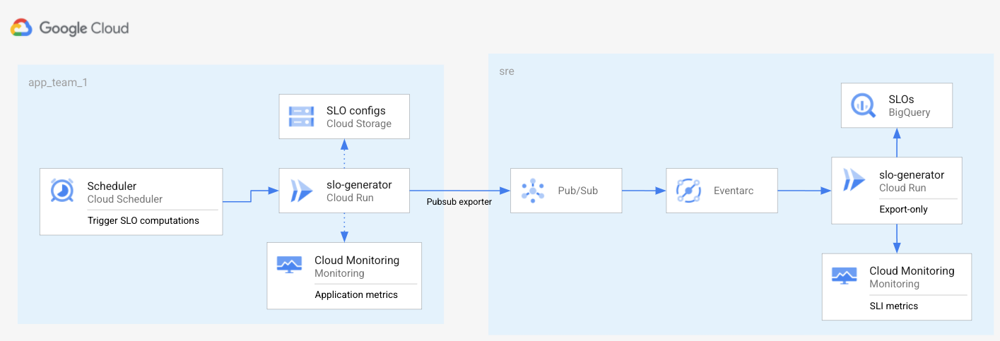

# SRE Service Example with Pubsub and Eventarc

This example illustrates how to use the `slo-generator` module, when the run
model is as follow:

- **SRE team** runs the `slo-generator` as-a-service for exporting SLO report **only** (no compute).
- **Team 1** want freedom to compute their SLOs; they want to run their own
`slo-generator` service on Cloud Run, and export only the SLOs they care about.
They use the SRE team export service through Pubsub and Eventarc so that SRE
team can get an overview on all SLOs.

## Prerequisites

To run this example, you'll need:

- a GCP project (see an example definition [here](../../test/setup/main.tf).
- the IAM role `roles/owner` on the project for the service account running the Terraform.

<!-- BEGINNING OF PRE-COMMIT-TERRAFORM DOCS HOOK -->
## Inputs

| Name | Description | Type | Default | Required |
|------|-------------|------|---------|:--------:|
| gcr\_project\_id | Google Container registry project where image is hosted | `string` | `"slo-generator-ci-a2b4"` | no |
| project\_id | Project id | `any` | n/a | yes |
| region | Region | `string` | `"us-east1"` | no |
| slo\_generator\_version | SLO generator version | `string` | `"latest"` | no |

## Outputs

| Name | Description |
|------|-------------|
| slo-generator | n/a |

<!-- END OF PRE-COMMIT-TERRAFORM DOCS HOOK -->

To provision this example, run the following from within this directory:
- `terraform init` to get the plugins
- `terraform plan` to see the infrastructure plan
- `terraform apply` to apply the infrastructure build
- `terraform destroy` to destroy the built infrastructure
