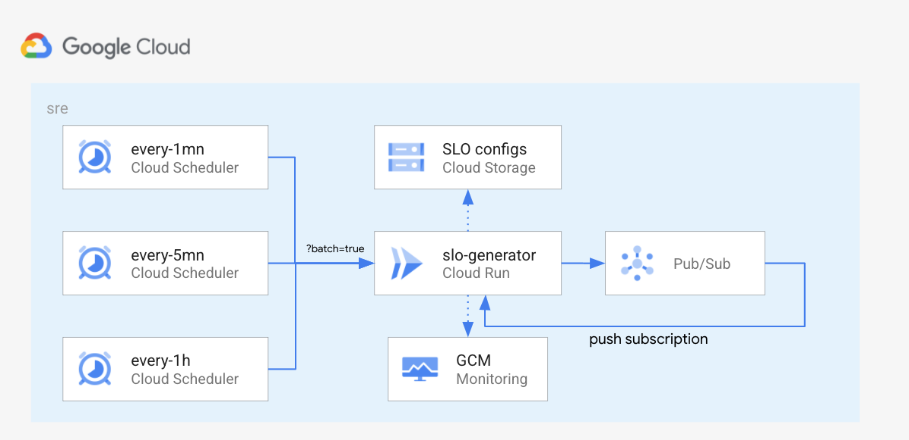

# SRE - Shared Cloud Schedulers w/ Pubsub

This example illustrates how to use the `slo-generator` module, with a simple
config (backend is Cloud Monitoring, and exporter is also Cloud Monitoring),
using shared Cloud Schedulers to diminish the costs associated with running
one scheduler per SLO.

This example uses the `slo-generator` api "batch mode", which re-distribute a
shared load coming from a Cloud Scheduler and splits it into individual messages
sent to a Pubsub topic. A Pubsub push subscription is created that will forward
each individual messages back to the service.

This setup is recommended if you have a high-volume of SLOs sharing the same
schedulers.

The Cloud Schedulers are associated with their corresponding SLO configs by
using the `spec.frequency` field in the SLO config.

## Prerequisites

To run this example, you'll need:

- a GCP project (see an example definition [here](../../test/setup/main.tf).
- the IAM role `roles/owner` on the project for the service account running the Terraform.

<!-- BEGINNING OF PRE-COMMIT-TERRAFORM DOCS HOOK -->
## Inputs

| Name | Description | Type | Default | Required |
|------|-------------|------|---------|:--------:|
| labels | Project labels | `map` | `{}` | no |
| project\_id | Project id | `any` | n/a | yes |
| region | Region | `string` | `"us-east1"` | no |
| schedule | Cron-like Cloud Scheduler schedule | `string` | `"* * * * */1"` | no |
| slo\_generator\_image | SLO generator image | `string` | `"ghcr.io/google/slo-generator"` | no |
| slo\_generator\_version | SLO generator version | `string` | `"master"` | no |

## Outputs

| Name | Description |
|------|-------------|
| freq\_map | n/a |

<!-- END OF PRE-COMMIT-TERRAFORM DOCS HOOK -->

To provision this example, run the following from within this directory:
- `terraform init` to get the plugins
- `terraform plan` to see the infrastructure plan
- `terraform apply` to apply the infrastructure build
- `terraform destroy` to destroy the built infrastructure
