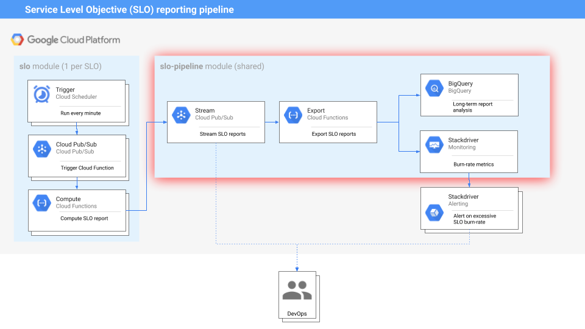

## SLO Pipeline

The SLO pipeline submodule creates the following resources:

* A **Pub/Sub topic** that will receive each SLO report.
* A **Cloud Function** that will process each SLO report and send them to a
  destination (BigQuery / Stackdriver Monitoring).
* A **JSON configuration file** (needed by the `slo-generator`), indicating what
  export destinations will be configured (`exporters.json`).
* A **JSON configuration file** (needed by the `slo-generator`), describing
  which error budgets to calculate (`error-budget-policy.json`).

## Pre-requisites
To use this module, you will need:

- A **GCP project** with the following APIs enabled:
  - App Engine API: `appengine.googleapis.com`
  - Cloud Functions API: `cloudfunctions.googleapis.com`
  - Monitoring API: `monitoring.googleapis.com`
  - Logging API: `logging.googleapis.com`
  - Pub/Sub API: `pubsub.googleapis.com`
  - Storage API: `storage.googleapis.com`
  - BigQuery API: `bigquery-json.googleapis.com`

- The following **IAM roles** on the project, for the service account running the Terraform:
  - App Engine Admin (`roles/appengine.appAdmin`)
  - Cloud Functions Admin (`roles/cloudfunctions.admin`)
  - PubSub Admin (`roles/pubsub.admin`)
  - Storage Admin (`roles/storage.admin`)
  - IAM Admin (`roles/iam.admin`)

- For the **BigQuery exporter**:
  - BigQuery Admin (`roles/bigquery.admin`)

See the [fixture project](../../test/setup/main.tf) for an example to create this project and enable the App Engine application using Terraform and the [Project Factory module](https://github.com/terraform-google-modules/terraform-google-project-factory).

<!-- BEGINNING OF PRE-COMMIT-TERRAFORM DOCS HOOK -->
## Inputs

| Name | Description | Type | Default | Required |
|------|-------------|:----:|:-----:|:-----:|
| dataset\_create | Whether to create the BigQuery dataset | bool | `"true"` | no |
| dataset\_default\_table\_expiration\_ms | The default lifetime of the slo table in the dataset, in milliseconds. Default is never (Recommended) | number | `"-1"` | no |
| exporters\_path | SLO exporters config file path | string | n/a | yes |
| exporters\_vars | Variables to dynamically replace in exporters config | map | n/a | yes |
| function\_bucket\_name | Name of the bucket to create to store the Cloud Function code | string | `"slo-pipeline"` | no |
| function\_memory | Memory in MB for the Cloud Function (increases with no. of SLOs) | string | `"128"` | no |
| function\_name | Cloud Function name | string | `"slo-pipeline"` | no |
| function\_source\_directory | The contents of this directory will be archived and used as the function source. (defaults to standard SLO generator code) | string | `""` | no |
| grant\_iam\_roles | Grant IAM roles to created service accounts | string | `"true"` | no |
| project\_id | Project id to create SLO infrastructure | string | n/a | yes |
| pubsub\_topic\_name | Pub/Sub topic name | string | `"slo-export-topic"` | no |
| region | Region for the App Engine app | string | `"us-east1"` | no |
| service\_account\_email | Service account email (optional) | string | `""` | no |
| service\_account\_name | Name of the service account to create | string | `"slo-pipeline"` | no |
| slo\_generator\_version | SLO generator library version | string | `"1.3.0"` | no |
| storage\_bucket\_location | The GCS location | string | `"US"` | no |
| storage\_bucket\_storage\_class | The Storage Class of the new bucket. Supported values include: STANDARD, MULTI_REGIONAL, REGIONAL, NEARLINE, COLDLINE | string | `"STANDARD"` | no |
| use\_custom\_service\_account | Use a custom service account (pass service_account_email if true) | bool | `"false"` | no |

## Outputs

| Name | Description |
|------|-------------|
| exporters | Exporter config |
| function\_bucket\_name | Cloud Function bucket name |
| function\_name | Cloud Function name |
| project\_id | Project id |
| pubsub\_topic\_name | Ingress PubSub topic to SLO pipeline |
| service\_account\_email | Service account email used to run the Cloud Function |

<!-- END OF PRE-COMMIT-TERRAFORM DOCS HOOK -->
